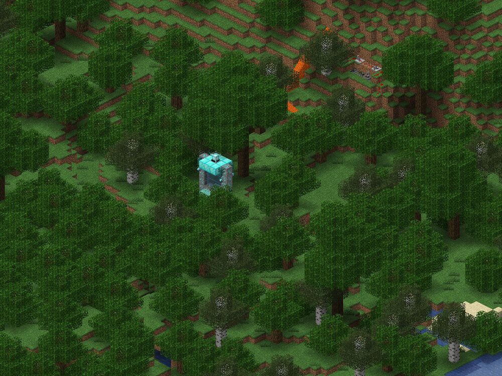
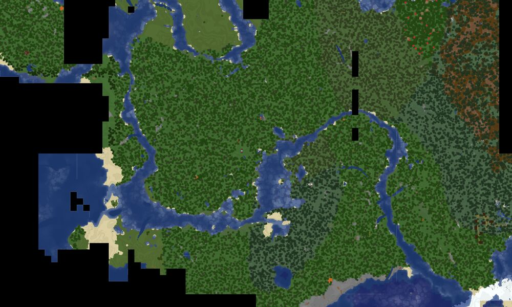

Creative Maps
=============

Pinecraft Map Generator scans our world once per day, and if any of the scanned regions have had signficant changes, updates our images automatically.

Here are some key areas on our Creative server.

Creative Portal
^^^^^^^^^^^^^^^

**Coordinates:** -28,~,-8

Welcome to our Patron-exclusive Creative server! Upon spawning in the Survival world, run North-West to the Public Portal where you can transport to the Creative world.

+--------------------+
| |creative_portal|  |
+--------------------+

+------------------------+
| |creative_portal_map|  |
+------------------------+

Add Your Base
^^^^^^^^^^^^^

Would you like your base added to this page? Ping Baldnerd on Discord.

**Tip:** The camera drone flies from the far South East with the camera facing North West. So if your build is hidden behind a mountain, or facing North or West, the drone may not see it, or not capture it in all its glory. Consider facing your builds South or East to ensure the best pictures.
