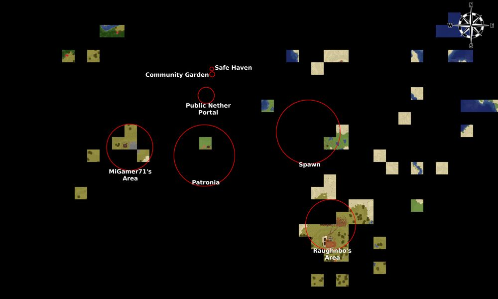
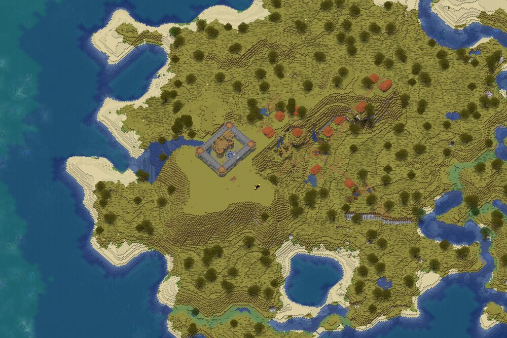
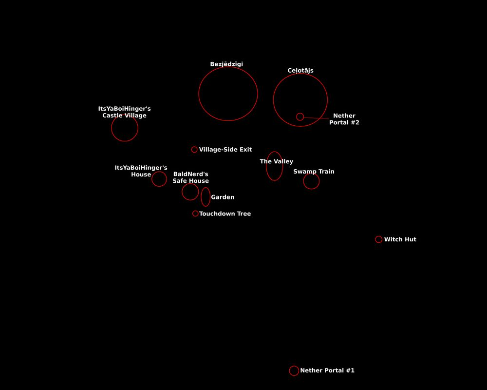
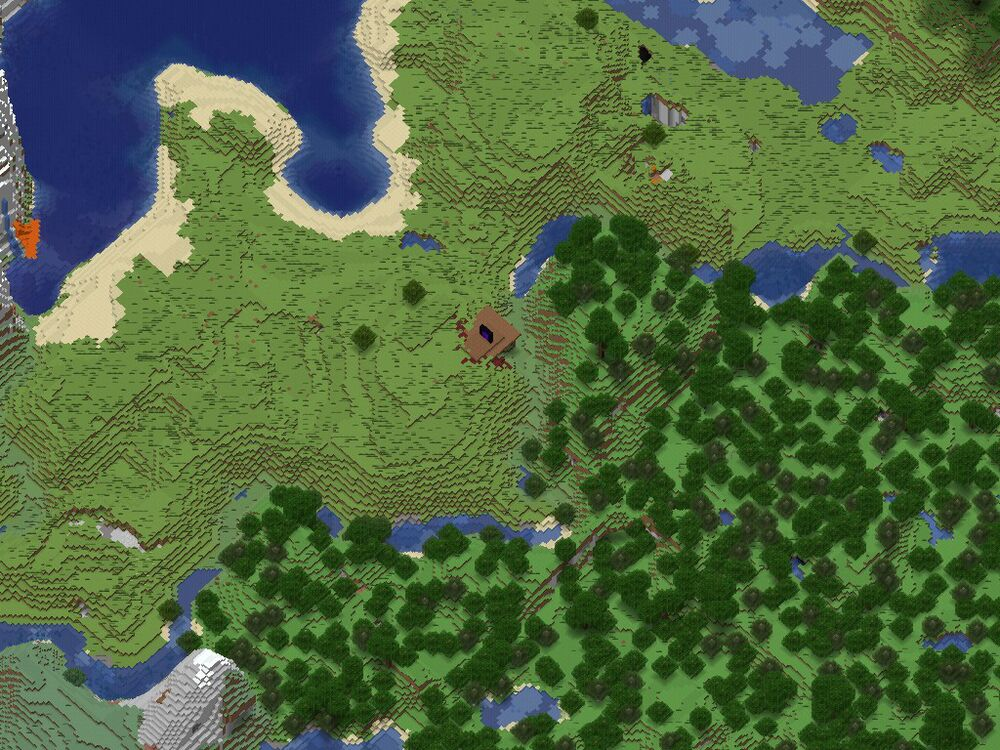
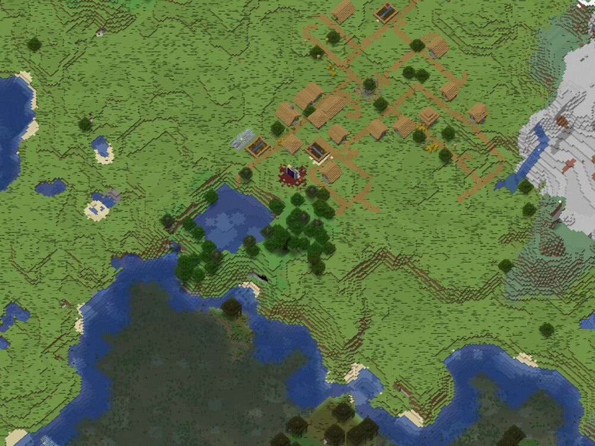
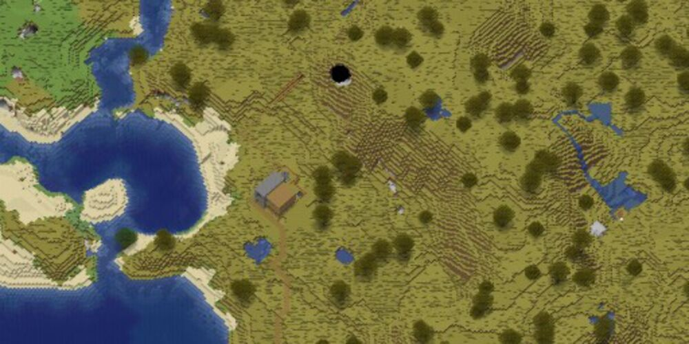
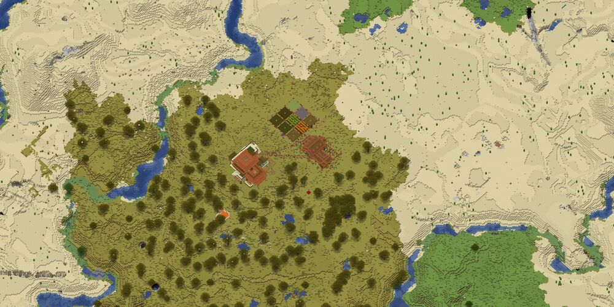
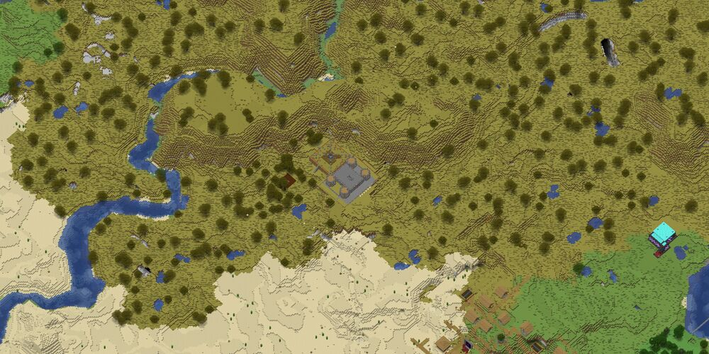
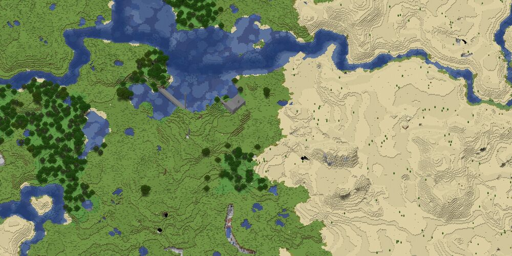

Survival Maps
=============

Pinecraft Map Generator scans our world once per day, and if any of the scanned regions have had signficant changes, updates our images automatically.

Here are some key areas on our Survival server.

Spawn
^^^^^

**Coordinates:** -278,~,224

Welcome to our Patron-exclusive Survival server! Upon spawning in our world, you'll notice an eclectic collision of biomes, with a small lava pool, a pond, and a desert just beyond the grassy fields.

Our beautiful spawn shelter provides a place to lay your head and stay safe should you spawn during the night.

Head west to find our Settler's Village, or explore the vast world.

+--------------+
| |spawn_map|  |
+--------------+

.. |spawn| image:: ../../img/pinecraft-maps/survival/spawn.jpg
    :width: 600px
    :alt: Spawn
    :target: https://raw.githubusercontent.com/Cat5TV/pinecraft-docs/main/img/pinecraft-maps/survival/spawn.webp

+----------+
| |spawn|  |
+----------+

Settler's Village
^^^^^^^^^^^^^^^^^

A short journey west of spawn, you'll find our community area. This shared space features a hillside village to the south named Patronia, a functional community nether portal in the heart of town, and a garden to the north with food to help you on your journey. Is it getting late? Take shelter in a rustic safe haven in the north mountainside, just beyond the garden, featuring two beds, a crafting table, and a furnace.

.. |settler| image:: ../../img/pinecraft-maps/survival/settlers-village.jpg
    :width: 600px
    :alt: Settler's Village
    :target: https://raw.githubusercontent.com/Cat5TV/pinecraft-docs/main/img/pinecraft-maps/survival/settlers-village.webp

+------------+
| |settler|  |
+------------+

Ginga Ninja's Island Oasis
^^^^^^^^^^^^^^^^^^^^^^^^^^

**Coordinates:** Private

This private island is home to _Ginga_Ninja, aka Jeff Weston from Category5 Technology TV.

.. |ginganinja| image:: ../../img/pinecraft-maps/survival/ginganinja.jpg
    :width: 600px
    :alt: Ginga Ninja's Island
    :target: https://raw.githubusercontent.com/Cat5TV/pinecraft-docs/main/img/pinecraft-maps/survival/ginganinja.webp

+---------------+
| |ginganinja|  |
+---------------+

The Fortress
------------

Preparing for a build, Ginga Ninja works his mines to get the resources he needs to build his oceanside fortress.

+------------------------+
| |ginganinja-fortress|  |
+------------------------+

Robbie rendered and re-rendered the fortress drone shot several times before speaking with Jeff about the strange
half nether portal. The assumption all along was that it was a glitch. But then Jeff showed an in-game screenshot.

+-------------------------+
| |ginganinja-ss-nether|  |
+-------------------------+

Baldnerd's Base
^^^^^^^^^^^^^^^

**Coordinates:** Private

The beautiful, distant land of Baldnerd, aka Robbie Ferguson from Category5 Technology TV. Robbie is also the server administrator, but all of the builds on his base and all travel are 100% Survival (no cheats, no creative mode, no flying, no teleporting).

+-----------------+
| |baldnerd_map|  |
+-----------------+

After days of weary travel, forced to abandon his horse at the ocean's edge, Baldnerd established his base of operation. With two broken nether portals in walking distance, and two villages beyond the mountain, resources are plentiful here.

If you find it, you'll recognize it by Touchdown Tree; the very first area Baldnerd rested following his long, arduous journey.

.. |baldnerd| image:: ../../img/pinecraft-maps/survival/baldnerd.jpg
    :width: 600px
    :alt: Baldnerd's Base
    :target: https://raw.githubusercontent.com/Cat5TV/pinecraft-docs/main/img/pinecraft-maps/survival/baldnerd.webp

+-------------+
| |baldnerd|  |
+-------------+

Survival Safe House
-------------------

What started as a simple but safe place for Baldnerd to rest his head after a long day working in his mine has grown into a massive structure to house many rooms.

.. |baldnerds_fortress| image:: ../../img/pinecraft-maps/survival/baldnerd_fortress_2021-12-07_20.58.50.png
    :width: 600px
    :alt: Baldnerd's Fortress
    :target: https://raw.githubusercontent.com/Cat5TV/pinecraft-docs/main/img/pinecraft-maps/survival/baldnerd_fortress_2021-12-07_20.58.50.png

+-----------------------+
| |baldnerds_fortress|  |
+-----------------------+

.. |baldnerd-safehouse| image:: ../../img/pinecraft-maps/survival/baldnerd-safehouse.jpg
    :width: 600px
    :alt: Baldnerd's Safehouse
    :target: https://raw.githubusercontent.com/Cat5TV/pinecraft-docs/main/img/pinecraft-maps/survival/baldnerd-safehouse.webp

+-----------------------+
| |baldnerd-safehouse|  |
+-----------------------+

Nether Portal 1
---------------

Top Side
^^^^^^^^

Baldnerd's first netherportal is just a short run around the bay from the safe house.

+-----------------------------+
| |baldnerd-netherportal-01|  |
+-----------------------------+

Nether Side
^^^^^^^^^^^

Quickly learning to craft and wear golden boots in the Nether, Baldnerd's portal landed him square in the middle of a massive grouping of Piglins.

+------------------------------+
| |baldnerd-netherportal-01n|  |
+------------------------------+

Nether Portal 1
---------------

Top Side
^^^^^^^^

On the north side of Baldnerd's mountain lay two villages, one of which contained an inactive nether portal. Having the needed tools on hand,
Baldnerd made haste and quickly had the portal up and running.

+-----------------------------+
| |baldnerd-netherportal-02|  |
+-----------------------------+

Nether Side
^^^^^^^^^^^

Watch your step! Entering the nether from Baldnerd's Nether Portal 2 means you'll find yourself on the edge of fiery lava pits. The plan
is to slowly build up the area to make it safer to navigate, and then Baldnerd will be able to explore and find out what mysteries lie on this
side of the portal.

.. |baldnerd-netherportal-02n| image:: ../../img/pinecraft-maps/survival/baldnerd-netherportal-02n.jpg
    :width: 600px
    :alt: Baldnerd's Nether Portal 2 - Nether Side
    :target: https://raw.githubusercontent.com/Cat5TV/pinecraft-docs/main/img/pinecraft-maps/survival/baldnerd-netherportal-02n.webp

+------------------------------+
| |baldnerd-netherportal-02n|  |
+------------------------------+

The Waterfall
-------------

Somewhere along the way between spawn and Baldnerd's Base, this scenic waterfall provides a place to refresh.

.. |baldnerd-waterfall| image:: ../../img/pinecraft-maps/survival/baldnerd-waterfall.jpg
    :width: 600px
    :alt: The Waterfall
    :target: https://raw.githubusercontent.com/Cat5TV/pinecraft-docs/main/img/pinecraft-maps/survival/baldnerd-waterfall.webp

+-----------------------+
| |baldnerd-waterfall|  |
+-----------------------+

ItsYaBoiHinger's Area
^^^^^^^^^^^^^^^^^^^^^

Just a little North-West of BaldNerd's safehouse, ItsYaBoiHinger is working on his builds.

+-------------------+
| |ItsYaBoiHinger|  |
+-------------------+

Raughnbo's Area
^^^^^^^^^^^^^^^

Raughnbo has been hard at work on what can only be described as a stunning survival build.

+------------------+
| |raughnbo_rome|  |
+------------------+

+-------------+
| |raughnbo|  |
+-------------+

MiGamer71's Area
^^^^^^^^^^^^^^^^

Visible from the west side of Patronia, MiGamer71 has been setting up an impressive build.

.. |migamer71_homestead| image:: ../../img/pinecraft-maps/survival/migamer71_homestead_2021-12-07_21.20.16.png
    :width: 600px
    :alt: MiGamer71's Homestead
    :target: https://raw.githubusercontent.com/Cat5TV/pinecraft-docs/main/img/pinecraft-maps/survival/migamer71_homestead_2021-12-07_21.20.16.png

+------------------------+
| |migamer71_homestead|  |
+------------------------+

+-----------------------+
| |migamer71_mob_farm|  |
+-----------------------+

+--------------+
| |migamer71|  |
+--------------+

bp9's Area
^^^^^^^^^^^^^^^^

Having worked the mines for several days, bp9's structures are starting to take shape.

+--------+
| |bp9|  |
+--------+

Rheticus
^^^^^^^^

**Coordinates:** Unknown

Does this top secret town even exist? Surely, the first to find it will be heartily rewarded. Rheticus has been designated as an admin area where some key survival rules do not apply.

.. |rheticus| image:: ../../img/pinecraft-maps/survival/rheticus.jpg
    :width: 600px
    :alt: Rheticus
    :target: https://raw.githubusercontent.com/Cat5TV/pinecraft-docs/main/img/pinecraft-maps/survival/rheticus.webp

+-------------+
| |rheticus|  |
+-------------+

Add Your Base
^^^^^^^^^^^^^

Would you like your base added to this page? Ping Baldnerd on Discord.

**Tip:** The camera drone flies from the far South East with the camera facing North West. So if your build is hidden behind a mountain, or facing North or West, the drone may not see it, or not capture it in all its glory. Consider facing your builds South or East to ensure the best pictures.
