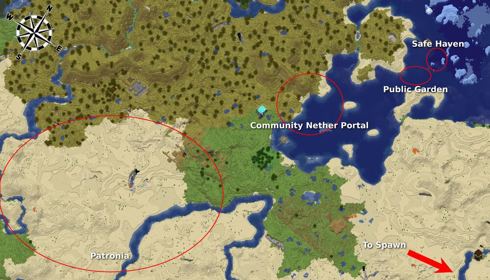
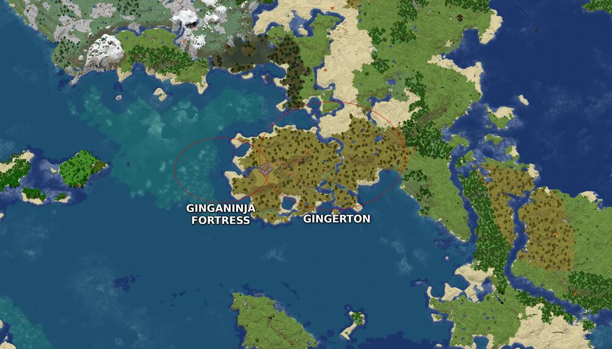

Survival Maps
=============

Pinecraft Map Generator scans our world once per day, and if any of the scanned regions have had signficant changes, updates our images automatically.

Here are some key areas on our Survival server.

Spawn
^^^^^

Welcome to our Patron-exclusive Survival server! Upon spawning in our world, you'll notice an eclectic collision of biomes, with a small lava pool, a pond, and a desert just beyond the grassy fields.

Our beautiful spawn shelter provides a place to lay your head and stay safe should you spawn during the night.

Head west to find our Settler's Village, or explore the vast world.

.. |spawn| image:: ../../img/pinecraft-maps/survival/spawn.jpg
    :width: 600px
    :alt: Spawn
    :target: https://raw.githubusercontent.com/Cat5TV/pinecraft-docs/main/img/pinecraft-maps/survival/spawn.webp

+----------+
| |spawn|  |
+----------+

Settler's Village
^^^^^^^^^^^^^^^^^

A short journey west of spawn, you'll find our community area. This shared space features a hillside village to the south named Patronia, a functional community nether portal in the heart of town, and a garden to the north with food to help you on your journey. Is it getting late? Take shelter in a rustic safe haven in the north mountainside, just beyond the garden, featuring two beds, a crafting table, and a furnace.

+------------+
| |settler|  |
+------------+

Ginga Ninja's Island
^^^^^^^^^^^^^^^^^^^^

+---------------+
| |ginganinja|  |
+---------------+

Baldnerd's Base
^^^^^^^^^^^^^^^

After days of weary traveling, forced to abandon his horse at the ocean's edge, Baldnerd established his base of operation. With two broken nether portals in walking distance, and two villages beyond the mountain, resources are plentiful here.

If you find it, you'll recognize it by Touchdown Tree; the very first area Baldnerd rested following his long, arduous journey.

.. |baldnerd| image:: ../../img/pinecraft-maps/survival/baldnerd.jpg
    :width: 600px
    :alt: Baldnerd's Base
    :target: https://raw.githubusercontent.com/Cat5TV/pinecraft-docs/main/img/pinecraft-maps/survival/baldnerd.webp

+-------------+
| |baldnerd|  |
+-------------+

Rheticus
^^^^^^^^

Does this top secret town even exist? Surely, the first to find it will be heartily rewarded.

.. |rheticus| image:: ../../img/pinecraft-maps/survival/rheticus.jpg
    :width: 600px
    :alt: Rheticus
    :target: https://raw.githubusercontent.com/Cat5TV/pinecraft-docs/main/img/pinecraft-maps/survival/rheticus.webp

+-------------+
| |rheticus|  |
+-------------+

Add Your Base
^^^^^^^^^^^^^

Would you like your base added to this page? Ping Baldnerd on Discord.
